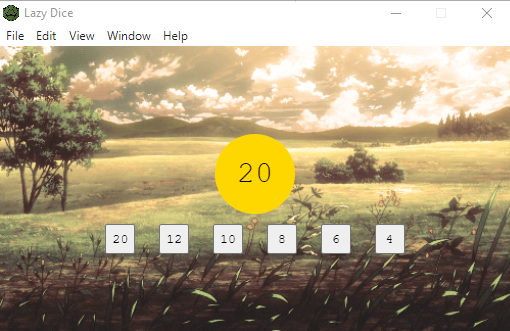
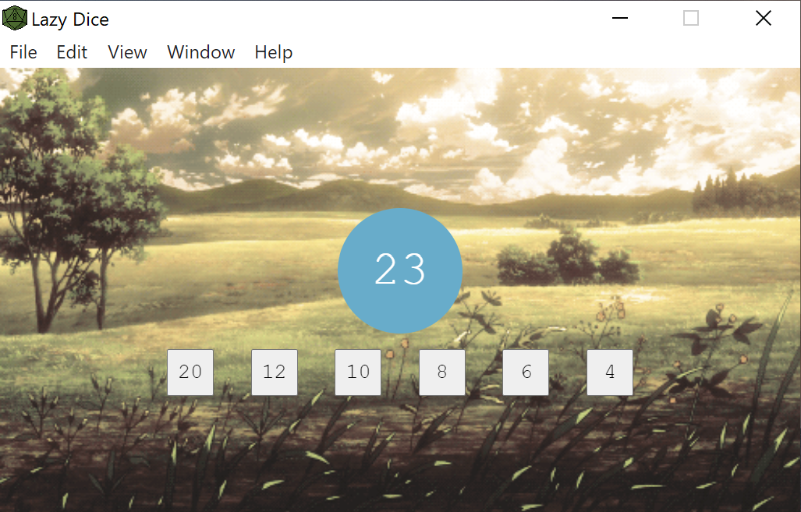

# Lazy Dice

## Purpose
Lazy dice is an always on top application to simulate dice rolls for four-sided dice, six-sided dice, 8-sided dice, 12-sided dice, and 20-sided dice. This app takes the place of having a set of physical dice needed for such table top role playing games like Dungeons and Dragons.

## Modes

**Single Roll**
<p>When the Roll Results are in the yellow circle this is the Single Roll mode. <br>
In this mode when you click on any one of the dice options a random number between 1 and the choice you picked will be displayed to the screen. The next roll will replace the previous roll</p>

**Additive Rolls**
<br>
When the Roll Results are in the blue circle this is the Additive Roll mode. 
<br>
In this mode when you click on any one of the dice options a random number between 1 and the choice you picked will be added to the current result displayed to the screen. This is great for calculating the damage for those higher level attacks.

## How to Install
Two options
### Option 1
**Download Compiled App**

Go to this Google Drive Folder
https://drive.google.com/drive/folders/1gxrlpS1pFYbypTdbbxCjoGdYiy2YsrA8?usp=sharing

Download the approptiate version for your OS

| OS      | Lazy Dice Version |
|---------|-------------------|
| Windows | win32             |
| Mac     | darwin            |
| Linux   | TBD               |

<br>
<br>

### Option 2
**Clone and Compile Latest Version**
Open up either a terminal or command prompt in the folder you would like to install

Then clone the repository 
(if you do not have git installed you can follow [this](https://git-scm.com/book/en/v2/Getting-Started-Installing-Git))
```
git clone git@github.com:andrewjknapp/lazy-dice.git
```

Install the dependencies
```
npm install
```

Compile the app
```
npm run compile
```

You can also run it at this point without compiling the app by running 
```
npm start
```

## Attribution
I am working on tracking down the original source for the background image. 
If you recognize this image or have an idea about its source I would be happy to hear from you!
Or if you have another gif with a similar aesthetic with a known attribution I would be even more excited to hear!!

## Screen Shots

*Single Roll Mode*
<br>

<br>
*Additive Roll Mode*
<br>

<br>

## Contact 
If you have any questions about this project or would like to give suggestions I would be happy to hear them!
<br>
You can contact me at <a href="mailto:ajknapp2015@gmail.com">ajknapp2015@gmail.com</a>
